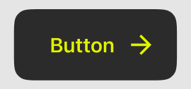

# KeyAppUI

Custom UI components, colors, fonts.

## Button

### TextButton



```swift
TextButton.style(
    title: "Buy",
    style: .primary,
    size: .medium,
    trailing: Icons.forwardIcon.image
)
```

### IconButton


```swift 
IconButton.style(
    image: Icons.forwardIcon.image
    title: "Info",
    style: .primary,
    size: .medium,
)
```